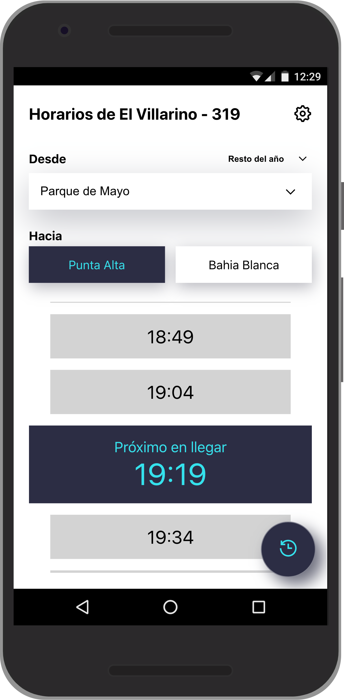
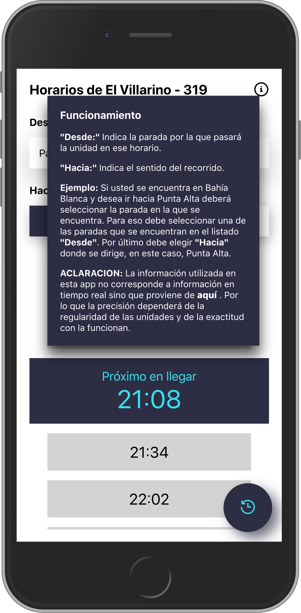
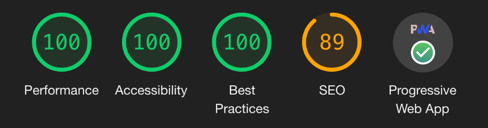

<!-- This project was bootstrapped with [Create React App](https://github.com/facebook/create-react-app). -->

# Horario Villarino - 319 app

  
  
  

  
  

## Why?

Because I'm very tire using this other [webpage](http://www.elvillarino.com.ar/). The main idea was improve the way of using the data about the timetables of the bus and create a user experience which could help to users to see what is the next to arrive at some selected bus stop.

## First Steps

First of all, I looked for the source of data (the timetables). After do a little of research and can't found any REST API to fetch the data and without any other option, I decided to build mine. I started to parse the table directly from the HTML of the page. After several hours of reverse engineering I end up with a little more clean data structure to work with. I built an ExpressJS app as a BE bypass to fetch and parse the HTML and finally send the specific times for a specific request.  
As a relevant thing, I can mention the use of [memory-cache](https://www.npmjs.com/package/memory-cache). Since the timetables doesn't change very often I decided to use a cache to avoid unnecessary GET request to the original url.

## And then, what?

Well, with the help of [Figma](https://www.figma.com/proto/RMNWpfzq30tpd2zGesaoHO/villarino?node-id=2%3A0&scaling=scale-down) I create few mockups to put some of my design ideas in something a little more real.
 
After this, because I like ReactJS and PWAs so much and I want to learn all that I can (I think one of the best way to learn something is reading about it but that's only the 50%, the other 50% is coding and making stuffs).
With the help of CRA I started a new app and then I began with the process of transform the design and ideas into real code/app. I will detail some concepts and features that I used or implemented.

<ul>
<li>Hooks (all components are functional and use  hooks only)
  <ul>
    <li>useState</li>
    <li>useEffect</li>
    <li>useCallback</li>
    <li>useReducer. In combination with the Context API I implemented the state management of the entire app following the redux's concepts.</li>
  </ul>
</li>
<li>OnLine/OffLine notification</li>
<li>New Update! notification (Service Worker promise based on)</li>
<li>All content is cached for offline use! notification</li>
<li>Responsive design (Mobile-first)</li>
<li>SVG icons</li>

## Deployment

To publish this beautiful app 😋, I used ▲ [Zeit Now](https://zeit.co/) to deploy both, BE and FE. I had to research and test a lot to find the correct now.json config but the effort wasn't useless.

</ul>
